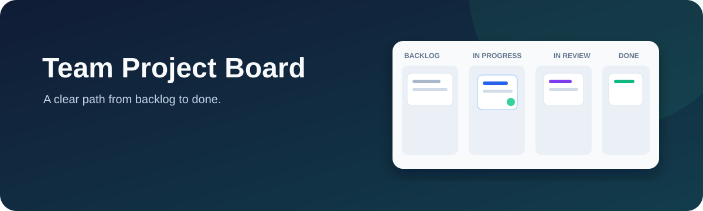

# Team Project Board



A collaborative Kanban board for small product teams. This portfolio build demonstrates task workflow, board filtering, accessible drag and drop, and a keyboard friendly status control.

## Features

- Move tasks among Backlog, In progress, In review, and Done with drag and drop.
- Change status from each task's native select control for keyboard and single pointer access.
- Search the board and filter to work assigned to you.
- Create tasks with priority, owner, and due date.
- Persist tasks and activity in browser local storage.
- Responsive layout with visible focus styles.

## Run locally

```bash
npm install
npm run dev
```

## Current scope

This is a front-end prototype. Tasks are stored in the current browser; authentication, shared persistence, and live collaboration are not connected yet. The Supabase migration is a schema proposal for the next milestone and has not been applied.

## Architecture

- Next.js App Router + React + TypeScript
- dnd-kit for pointer and keyboard drag interactions
- Local storage for the demo state
- Supabase/Postgres migration for workspaces, memberships, tasks, comments, and activity

## Roadmap

1. Add Supabase Auth and workspace-scoped row-level security.
2. Replace local storage with server actions and Supabase Realtime.
3. Add comments, labels, and optimistic updates.
4. Add integration tests and deploy the app.

## Database proposal

See [`supabase/migrations/202610010001_initial_schema.sql`](supabase/migrations/202610010001_initial_schema.sql).

